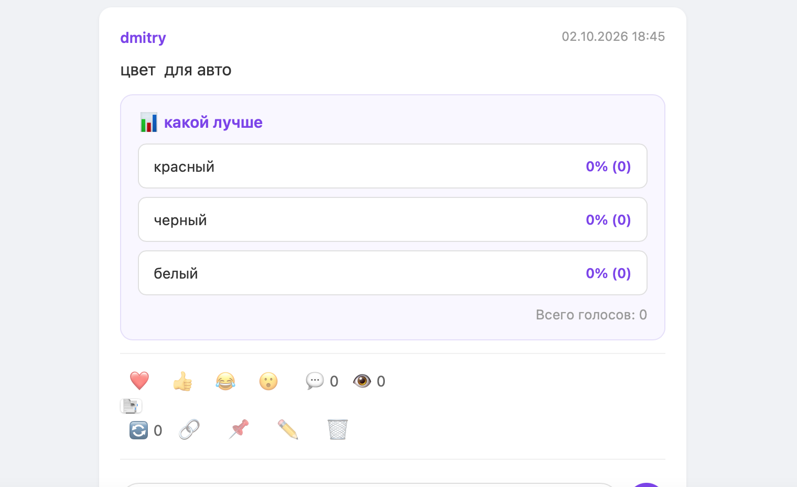
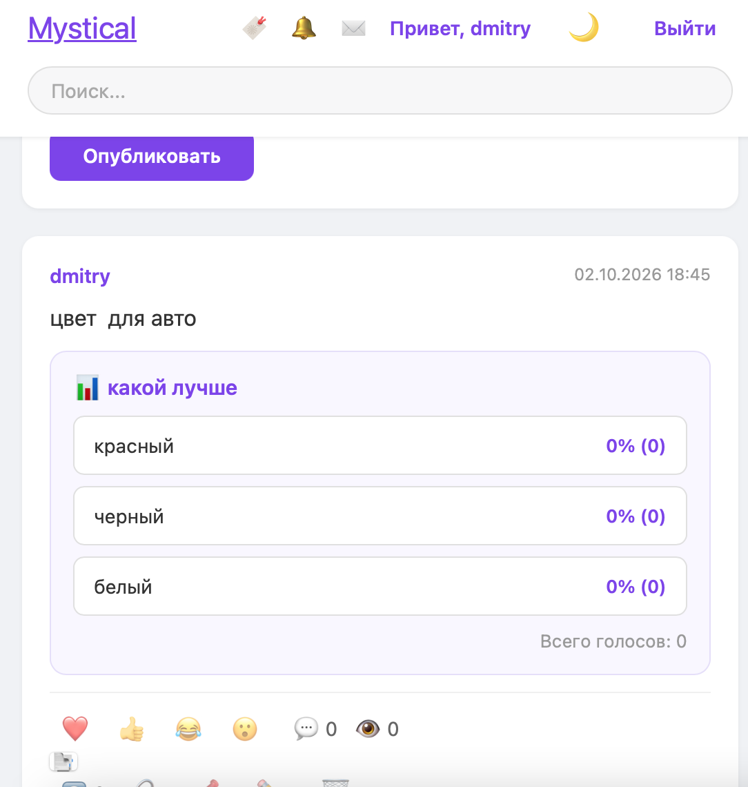

# ✨ Mystical — социальная сеть на Flask

**Mystical** — полноценная социальная сеть на Flask. **37+ фич**: посты, реакции, опросы, чаты, PWA, статистика, админ-панель.

---

## 📸 Скриншоты

### 🏠 Лента (светлая тема)

### 🌙 Лента (тёмная тема)

### 👤 Профиль пользователя

### 🗳 Пост с опросом

### 💬 Чат

### 🔔 Уведомления

### 📊 Статистика профиля

### 📱 Мобильный вид

### ✉️ Сообщения

### 🔖 Закладки

---

## ✨ Возможности (37+ фич)

### 👤 Пользователи
- 🔐 Регистрация и вход (pbkdf2:sha256)
- 🖼 Профили с аватаркой, bio, городом, сайтом
- 🎨 Кастомный акцентный цвет профиля (6 вариантов)
- ✏️ Редактирование профиля
- 🔑 Смена пароля с валидацией
- 👥 Подписки и подписчики
- 📋 Списки подписчиков/подписок
- 🚫 Блокировка юзеров (взаимная)
- 📊 Статистика профиля
- 🛡 Админ-панель

### 📝 Контент
- 📝 Создание, редактирование, удаление постов
- ❤️ 👍 😂 😮 4 эмодзи-реакции
- 💬 Комментарии с аватарками
- 🔄 Репосты
- 🔖 Закладки
- 🏷 Хэштеги #tag
- @ Упоминания @username
- 📌 Закреплённый пост
- 🗳 Опросы с процентами
- 👁 Счётчик просмотров
- 🔗 Ссылка «Поделиться»
- ⚠️ Жалобы на контент

### 💬 Общение
- ✉️ Личные сообщения (чат 1-на-1)
- ⚡ Автообновление чата (5 сек)
- 📌 Закреплённые чаты
- 🔔 Уведомления с аватарками
- 🗑 Удаление уведомлений

### 🎨 Интерфейс
- 🌙 Тёмная/светлая тема
- 🌍 Лента: Все / Подписки
- 📊 Сортировка: новые / популярные / обсуждаемые
- 📱 Адаптив
- 🔍 Поиск
- 💜 Фиолетовая тема

### 📱 PWA
- 📲 Установка как приложение
- ⚡ Service Worker
- 🖼 Иконки (192x192, 512x512)

---

## 🛠️ Технологии

| Слой | Стек |
|---|---|
| Backend | Python 3.8+, Flask 3.0 |
| БД | SQLAlchemy + SQLite (легко → PostgreSQL) |
| Аутентификация | Werkzeug (pbkdf2:sha256) |
| Шаблоны | Jinja2 |
| Фронтенд | HTML5, CSS3, Vanilla JS |
| PWA | Service Worker, Manifest |
| Прод | Gunicorn + Nginx |

---

## 🚀 Быстрый старт

git clone https://github.com/Pontik1987/mystical.git
cd mystical
python3 -m venv venv
source venv/bin/activate
pip install -r requirements.txt
python app.py

Открыть: http://127.0.0.1:5000

Первый зарегистрированный юзер — админ (/admin/reports).

---

## 📊 Цифры проекта

- 37+ фич
- 13 таблиц БД
- 21 HTML-шаблон
- 2200+ строк CSS
- ~1000 строк Python
- 30+ коммитов

---

## 📄 Лицензия

MIT License — свободно используйте, изменяйте, распространяйте.

---

## 👨‍💻 Автор

**Dmitry** — @Pontik1987

---

**Сделано с ❤️ на Flask**
